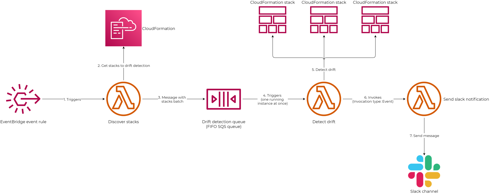

# CloudFormation drift detector to Slack

## How it works

 1. CloudWatch triggers DiscoverStacks Lambda function.
 2. DiscoverStacks Lambda function gets stacks from CloudFormation.
 3. DiscoverStacks Lambda will split all of those stacks into smaller batches (for example 10 stacks per batch) and publish them to the SQS FIFO queue with the same MessageGroupID to prevent parallel invocations.
 4. DetectDrift Lambda function will be triggered by the FIFO queue and will perform actual drift detection on stacks.
 5. After drift detection, DetectDrift Lambda will invoke SendSlackNotification Lambda function asynchronously, and this Lambda will send an appropriate message to the Slack.



## Parameters

 * SlackWebhook - Webhook URL for pushing messages to Slack.
 * Cron - How often drift detection should be run (eg. every twelve hours `0 0 */12 * ? *` more info [here](https://docs.aws.amazon.com/AmazonCloudWatch/latest/events/ScheduledEvents.html)).
 * ShowInSyncResources - Skip reporting of resources with no drift (reduces Slack message output, the default value is `false`).
 * StackRegex - Defines which stacks should be scanned for resource drift (the default value is `.*`).
 * StackBatches - Number that indicates how many stacks should be send to SQS in one batch (the default value is `10`). The duration of drift detection depends very much on the specific stack, some stacks have more resources, others less. When stack will have a lot of resources then the parameter should be decreased.

More details can be found at https://driftdetector.com


## Local setup

Prerequisites:

 * Python3
 * Python virtualenv

Install dependencies by running:

```sh
pip install -r requirements.txt
```

## Testing

Executing unit tests:

```sh
make test
```